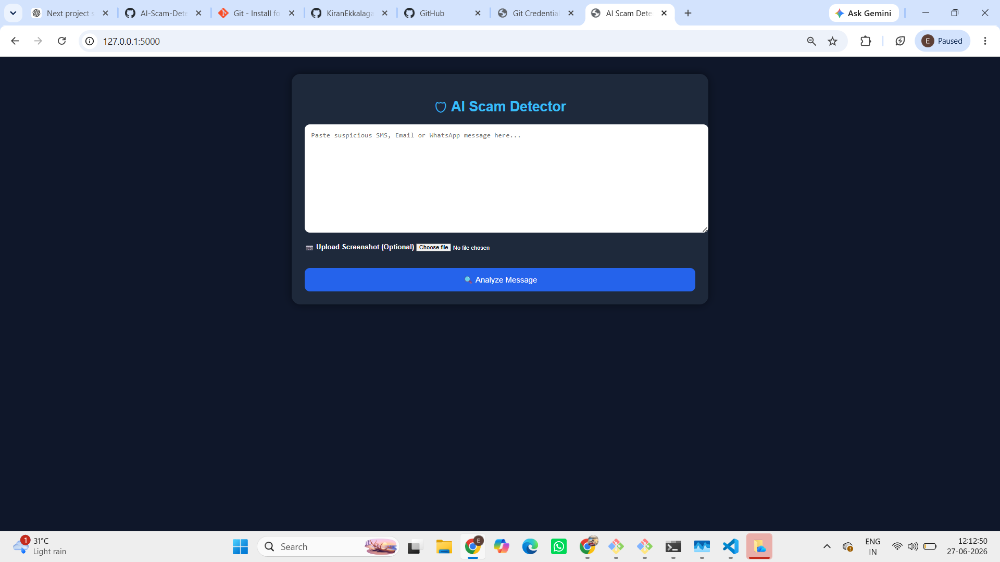
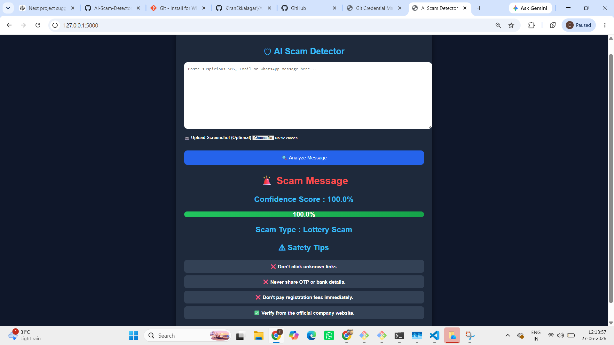
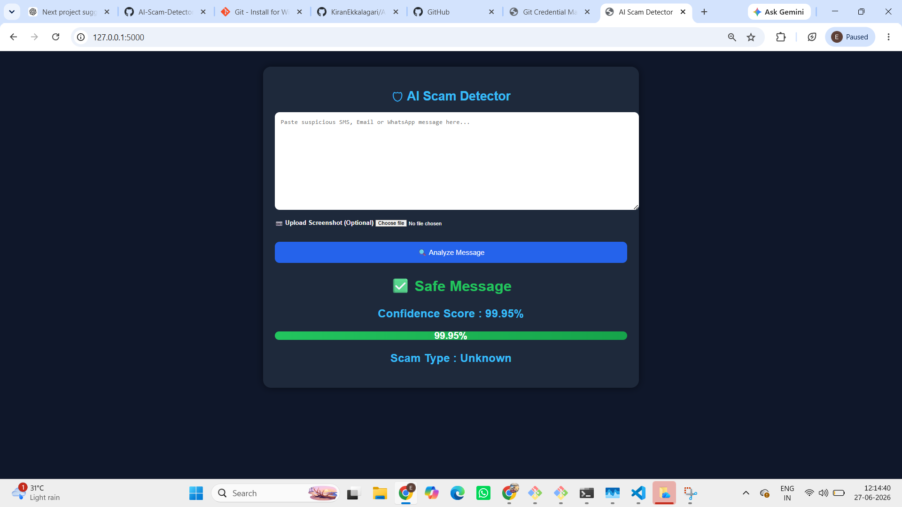

# 🛡️ AI Scam Detector

An AI-powered web application that detects scam messages from **SMS, WhatsApp, Emails, and Screenshots** using **Machine Learning** and **OCR (Optical Character Recognition)**.

---

## 🚀 Features

- 🔍 Detect Scam and Safe messages
- 📷 OCR support for screenshots
- 📊 Confidence Score
- 🏷️ Scam Type Detection
- ⚠️ Safety Tips
- 💻 Responsive User Interface

---

## 🛠️ Tech Stack

- Python
- Flask
- HTML5
- CSS3
- Pandas
- Scikit-learn
- Tesseract OCR
- pytesseract
- Pillow (PIL)

---

## 📂 Project Structure

```text
AI-Scam-Detector/
│
├── static/
│   └── style.css
├── templates/
│   └── index.html
├── uploads/
├── main.py
├── ocr.py
├── scam_dataset.csv
├── requirements.txt
├── README.md
└── .gitignore
```

---

## ⚙️ Installation

```bash
git clone https://github.com/KiranEkkalagari/AI-Scam-Detector.git
```

```bash
pip install -r requirements.txt
```

```bash
python main.py
```

Open your browser:

```
http://127.0.0.1:5000
```

---

## 📸 Current Features

- ✅ Text Scam Detection
- ✅ Screenshot OCR Detection
- ✅ Confidence Score
- ✅ Scam Type Classification
- ✅ Safety Tips

---

## 🔮 Future Improvements

- TF-IDF + Logistic Regression
- Larger Training Dataset
- AI-based Scam Explanation
- URL Reputation Check
- Email Scam Detection
- Dashboard & History

---

## 👨‍💻 Developer

**Ekkalagari Kiran**

Electronics & Communication Engineering (ECE)

Python | Flask | Machine Learning | OCR

---

---

## 📸 Project Screenshots

### 🏠 Home Page


### 📄 OCR Text Detection


### ✅ Safe Message Prediction


⭐ If you found this project useful, consider giving it a Star.
